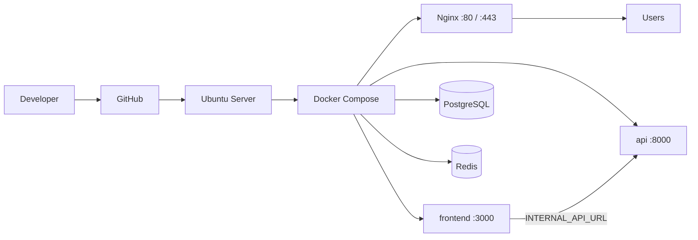

# Production deployment
sudo apt update
sudo apt install -y ca-certificates curl gnupg lsb-release

sudo mkdir -p /etc/apt/keyrings
curl -fsSL https://download.docker.com/linux/ubuntu/gpg | sudo gpg --dearmor -o /etc/apt/keyrings/docker.gpg

echo \
  "deb [arch=$(dpkg --print-architecture) signed-by=/etc/apt/keyrings/docker.gpg] https://download.docker.com/linux/ubuntu \
  $(lsb_release -cs) stable" | sudo tee /etc/apt/sources.list.d/docker.list > /dev/null

sudo apt update
sudo apt install -y docker-ce docker-ce-cli containerd.io docker-compose-plugin
**Architecture:** Developer → GitHub → Ubuntu Server → Docker Compose → Nginx → `www.multivateskill.com` → HTTPS → Users



Only **Nginx** is exposed to the internet. The API is internal to the Docker network. The Next.js app (BFF) proxies all `/api/*` calls to the API.

---

## What runs in production

| Container | Role | Exposed |
|-----------|------|---------|
| **nginx** | Reverse proxy, SSL termination | Ports 80, 443 |
| **frontend** | Next.js app + BFF | Internal only |
| **api** | FastAPI | Internal only |
| **db** | PostgreSQL | Internal only |
| **redis** | OTP, MFA, OAuth state | Internal only |

**Compose file:** `docker-compose.prod.yml`  
**Env file:** `.env.production` (copy from `.env.production.example`)

---

## Server requirements

- Ubuntu 22.04 or 24.04 LTS
- Docker Engine + Docker Compose v2
- Domain `www.multivateskill.com` DNS A record → server IP
- Optional: `multivateskill.com` → same IP (for redirect)

Install Docker on Ubuntu:

```bash
sudo apt update
sudo apt install -y ca-certificates curl
curl -fsSL https://get.docker.com | sudo sh
sudo usermod -aG docker $USER
# Log out and back in
```

---

## First deploy (step by step)

### 1. Clone from GitHub

```bash
cd /opt
sudo git clone https://github.com/AdewaleData/MULTIVATE.git multivate
sudo chown -R $USER:$USER multivate
cd multivate
```

### 2. Configure environment

```bash
cp .env.production.example .env.production
nano .env.production
```

Fill in at minimum:

- `POSTGRES_PASSWORD` — strong random password
- `SECRET_KEY` — min 32 characters
- `PLATFORM_ADMIN_PASSWORD` — min 12 characters
- `RESEND_API_KEY` — from Resend dashboard
- `CERTBOT_EMAIL` — for Let's Encrypt
- `CORS_ORIGINS` — `https://www.multivateskill.com,https://multivateskill.com`

### 3. Start the stack (HTTP first)

```bash
chmod +x scripts/deploy-ubuntu.sh scripts/issue-ssl.sh
./scripts/deploy-ubuntu.sh
```

This builds and starts all containers. Nginx uses `docker/nginx/conf.d/app.http.conf` so the site works on **HTTP** while you obtain SSL.

Check:

```bash
docker compose -f docker-compose.prod.yml --env-file .env.production ps
docker compose -f docker-compose.prod.yml --env-file .env.production logs -f api
```

Visit `http://www.multivateskill.com` — you should see the app.

### 4. Enable HTTPS (Let's Encrypt)

Point DNS to the server first, then:

```bash
./scripts/issue-ssl.sh
```

This:

1. Runs Certbot (webroot challenge via Nginx)
2. Copies `docker/nginx/templates/app.ssl.conf` → `conf.d/app.conf`
3. Removes the HTTP-only config
4. Reloads Nginx

Visit `https://www.multivateskill.com`.

### 5. Renew SSL (cron)

Add to crontab on the server (`crontab -e`):

```cron
0 3 * * * docker run --rm -v multivate-prod_certbot_conf:/etc/letsencrypt -v multivate-prod_certbot_www:/var/www/certbot certbot/certbot renew --quiet && docker compose -f /opt/multivate/docker-compose.prod.yml --env-file /opt/multivate/.env.production exec nginx nginx -s reload
```

Adjust paths if your repo is not in `/opt/multivate`.

---

## Deploy updates (after code changes)

```bash
cd /opt/multivate
git pull origin main
docker compose -f docker-compose.prod.yml --env-file .env.production up -d --build
```

Migrations run automatically when the API container starts (`alembic upgrade head`).

---

## OAuth redirect URIs

Register these with Google / Apple:

- `https://www.multivateskill.com/api/auth/oauth/google/callback`
- `https://www.multivateskill.com/api/auth/oauth/apple/callback`

Set `GOOGLE_*` and `APPLE_*` in `.env.production`.

---

## Local development (unchanged)

Local dev does **not** use the production compose file:

```bash
docker compose up -d db redis          # local data services only
cd backend && uvicorn ...             # API on :8000 or :8001
cd frontend && pnpm dev                # Next on :3000
```

See root `README.md` for details.

---

## Post-deploy checklist

- [ ] `https://www.multivateskill.com` loads
- [ ] Sign up / login works (Redis + Resend configured)
- [ ] Dashboard accessible after login
- [ ] Course enrollment + bank transfer flow works
- [ ] Admin can approve payments
- [ ] SSL certificate valid (padlock in browser)

---

## Troubleshooting

| Problem | Check |
|---------|--------|
| 502 Bad Gateway | `docker compose ... logs frontend api nginx` |
| Sign-up fails | Redis running? `REDIS_URL` correct? |
| No emails | `RESEND_API_KEY` and verified sender domain |
| API won't start | Database password in `.env.production` matches `POSTGRES_PASSWORD` |
| SSL fails | DNS propagated? Port 80 open? Run `./scripts/issue-ssl.sh` again |

---

## Architecture reference

See root `README.md` for local setup and monorepo overview.


sudo mkdir -p /opt
sudo chown $USER:$USER /opt
cd /opt
git clone https://github.com/Multivate/multivate-skills.git multivate
cd multivate

docker --version
docker compose version

ls -la .env.production || cp .env.production.example .env.production
grep '^DOMAIN=' .env.production || sed -n '1,80p' .env.production

# check nginx server_name
sed -n '1,160p' docker/nginx/conf.d/app.http.conf
sed -n '1,200p' docker/nginx/templates/app.ssl.conf

# check certbot volumes in compose
sed -n '1,240p' docker-compose.prod.yml | sed -n '1,200p'

# check scripts reference to certbot volumes
sed -n '1,200p' scripts/issue-ssl.sh
sed -n '1,200p' scripts/deploy-ubuntu.sh

chmod +x scripts/deploy-ubuntu.sh scripts/issue-ssl.sh

sudo ufw allow OpenSSH
sudo ufw allow 80/tcp
sudo ufw allow 443/tcp
sudo ufw enable

./scripts/deploy-ubuntu.sh
# if permission problems:
sudo ./scripts/deploy-ubuntu.sh

docker compose -f docker-compose.prod.yml --env-file .env.production ps
docker compose -f docker-compose.prod.yml --env-file .env.production logs -f api
docker compose -f docker-compose.prod.yml --env-file .env.production logs -f frontend
docker compose -f docker-compose.prod.yml --env-file .env.production logs -f nginx

./scripts/issue-ssl.sh
# or:
sudo ./scripts/issue-ssl.sh

docker compose -f docker-compose.prod.yml --env-file .env.production ps
docker compose -f docker-compose.prod.yml --env-file .env.production exec nginx nginx -t
# visit https://<your-domain>

cd /opt/multivate
git fetch origin
git pull origin main
# rebuild and restart
docker-compose -f docker-compose.prod.yml --env-file .env.production up -d --build
